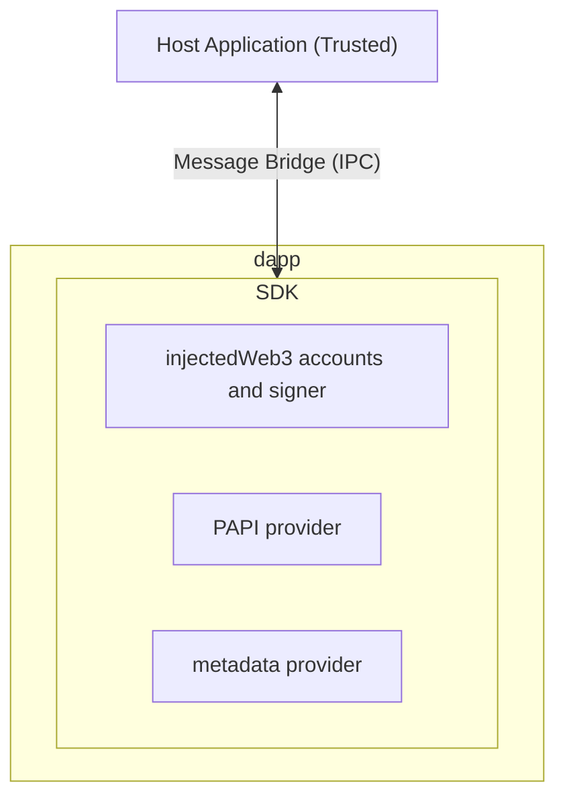

# Novasama dapp SDK and execution container

A robust solution for hosting and managing decentralized applications (dapps) within the Polkadot ecosystem.

## Docs

* [SDK README](./packages/sdk/README.md) (for dapp developers)
* [Host container README](./packages/host-container/README.md) (for host application developers)

## Architecture

