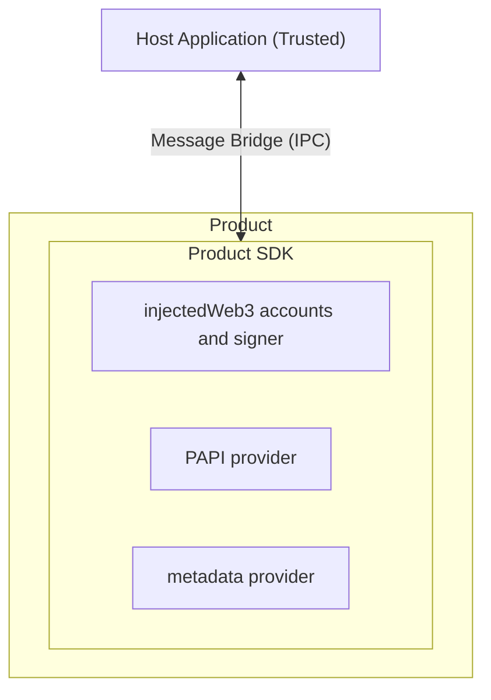

# Novasama dapp SDK and execution container

A robust solution for hosting and managing decentralized applications (dapps) within the Polkadot ecosystem.

> [!WARNING]
> **🔬 Proof of Concept**
> 
> This project is currently a **Proof of Concept (POC)** implementation. It is intended for experimental and demonstration purposes. Features, APIs, and architecture may change significantly as the project evolves. Not recommended for production use at this stage.

## Docs

* [Product SDK README](packages/product-sdk/README.md) (for dapp developers)
* [Host Container README](./packages/host-container/README.md) (for host application developers)
* [Host API README](./packages/host-api/README.md) (for host application developers)

## Architecture

## Contribution

See [CONTRIBUTING.md](./CONTRIBUTING.md) for more information.
